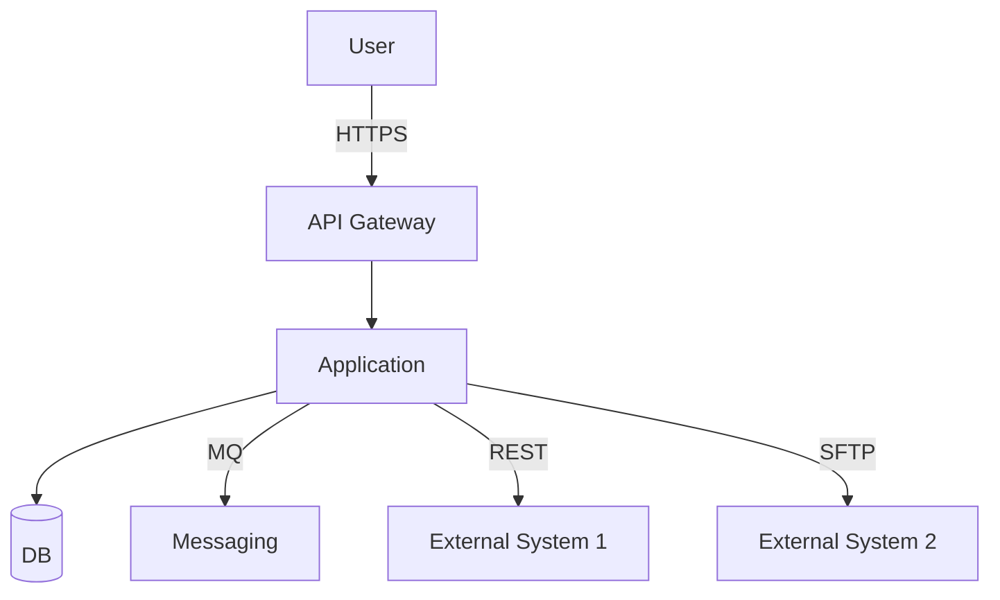
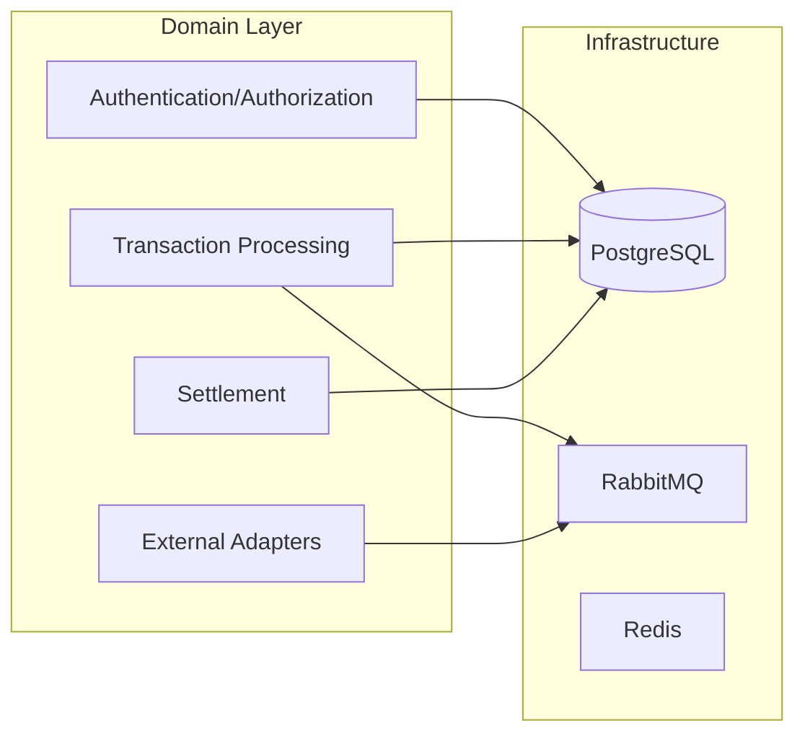
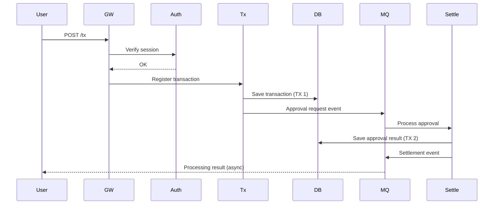

# Architecture Overview — {project name}

> **Version**: 1.0
> **Date**: {YYYY-MM-DD}
> **Audience**: Executives / new hires / external auditors
> **Prerequisite ADRs**: ADR-001 ~ ADR-NNN

---

## 1. System Context (C4 Level 1)

## 2. Components (C4 Level 2)

## 3. Domain Package Isolation

| Package | Domain | External Channel | ADR |
|--------|--------|----------|-----|
| `com.{domain}.{prj}.auth` | Authentication·authorization | - | ADR-008 |
| `com.{domain}.{prj}.tx` | Transaction processing | RabbitMQ | ADR-002 |
| `com.{domain}.{prj}.settle` | Settlement | - | ADR-003 |
| `com.{domain}.{prj}.ext.kftc` | Payment gateway | REST OAuth2 | ADR-008 |
| `com.{domain}.{prj}.ext.bnp` | Head office integration | TCP / MQ | ADR-008 |

> **Isolation principle**: direct dependencies between domains are strictly forbidden (enforced by ArchUnit at build time). Cross-domain interaction goes through events or explicit interfaces.

## 4. Data Flow (example scenario)

### 4.1 Transaction Registration → Approval → Settlement

## 5. Transaction Boundaries (ADR-002)

| Boundary | Scope | Isolation Level |
|------|------|---------|
| Transaction registration | Single DB | READ_COMMITTED |
| Approval processing | Transaction + approval | READ_COMMITTED + Outbox |
| Settlement | Settlement + accounting | SERIALIZABLE |
| External dispatch | Outbox + retry | REQUIRES_NEW |

> **Outbox pattern**: saving the transaction to the DB and saving the Outbox event occur in the same DB transaction. A separate publisher sends Outbox → MQ.

## 6. Non-Functional Architecture

### 6.1 Performance
- Connection pool: HikariCP (max 50)
- Cache: Caffeine (local) + Redis (shared)
- Async: `@Async` + Virtual Thread (Java 21+)

### 6.2 Security
- Authentication: OAuth2 + JWT (RS256) — ADR-008
- Authorization: RBAC + ABAC hybrid
- Encryption: PII = AES-256-GCM (KMS) — ADR-005
- Transport: TLS 1.3 / mTLS (external) — ADR-008
- Key management: AWS KMS / HSM — ADR-007

### 6.3 Availability
- Deployment: Blue-Green (K8s)
- DR: Multi-AZ + cross-region replica
- Backup: hourly + daily full backup

### 6.4 Scalability
- Horizontal scaling: stateless services → K8s HPA
- DB: read replicas + shard-ready key design
- Messaging: queue partition distribution

## 7. External Channel Integration

| Channel | Protocol | Authentication | Retry |
|------|---------|------|------|
| {Payment gateway} | REST + OAuth2 | Client Credentials + TLS | Resilience4j (4 attempts, exponential) |
| {Head office MQ} | RabbitMQ AMQP | TLS + SASL | DLX + reprocessing |
| {External TCP} | TCP fixed-width / 4B prefix | mTLS | Queue + resend |
| {File transfer} | SFTP | SSH key | Hourly polling + duplicate detection |

## 8. ADR Catalog (summary)

| ADR | Title | Status |
|-----|------|------|
| ADR-001 | Technology stack decision | ACCEPTED |
| ADR-002 | Transaction model | ACCEPTED |
| ADR-003 | Persistence strategy | ACCEPTED |
| ADR-004 | Message integrity | ACCEPTED |
| ADR-005 | PII encryption | ACCEPTED |
| ADR-006 | Audit logging | ACCEPTED |
| ADR-007 | Key management | ACCEPTED |
| ADR-008 | External channel authentication | ACCEPTED |
| ADR-009 | Retry / idempotency | ACCEPTED |
| ADR-010 | Domain isolation | ACCEPTED |

All ADRs: `docs/design/adr/`

## 9. Operations / Monitoring

| Area | Tools |
|------|------|
| Metrics | Prometheus + Grafana |
| Logs | ELK Stack (Elasticsearch + Kibana) |
| APM | DataDog / New Relic |
| Tracing | OpenTelemetry + Jaeger |
| Alerting | Slack + PagerDuty + SMS |

## 10. Future Roadmap

- Quarter 1: integrate additional domains
- Quarter 2: evaluate event sourcing
- Quarter 3: AI recommendation / prediction features

---

**Approval**
| Date | Approver | Comment |
|------|--------|------|
| {YYYY-MM-DD} | Architect | |
| {YYYY-MM-DD} | PM | |
