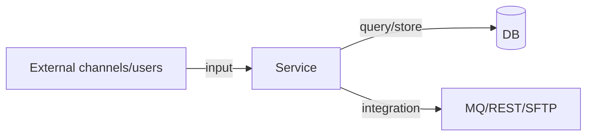

# Threat Model — {Project Name}

> **Authoring skill**: `03-draft-dev-plan` (design phase, before G2)
> **Lead**: `architect` / **Review**: `security-auditor`
> **Methodology**: STRIDE + attack surface analysis
> **Update triggers**: Architecture changes, new external channels, new PII processing (record changes via ADR)

---

## 1. Scope / Trust Boundaries

- Systems / components under analysis: {…}
- Trust boundaries: {e.g., Internet ↔ DMZ ↔ internal network ↔ DB; external channel boundaries (MQ/REST/SFTP)}
- Assets (what to protect): {PII / account & transaction data / keys & secrets / audit logs …}

### Data Flow Diagram (DFD) Overview

> Every flow that crosses a trust boundary is in scope for the threat analysis in §2.

## 2. STRIDE Threat Analysis

Identify threats per component/data flow. (If not applicable, mark `N/A` + rationale)

| ID | Component/Flow | STRIDE | Threat Scenario | Impact | Mitigation | Linked ADR / REQ |
|----|--------------|--------|--------------|------|--------|----------------|
| TM-001 | {Login API} | **S**poofing | Credential theft | High | MFA/OAuth2 | NFR-SEC-AUTH / ADR-008 |
| TM-002 | {Transaction processing} | **T**ampering | Message forgery/tampering | High | HMAC/signatures | ADR-004 |
| TM-003 | {Audit logs} | **R**epudiation | Denial of actions | Medium | Integrity-protected logs & signatures | ADR-006 |
| TM-004 | {PII storage} | **I**nfo Disclosure | Plaintext exposure | High | AES-256-GCM & masking | ADR-005 |
| TM-005 | {External channels} | **D**oS | Overload/connection exhaustion | Medium | Timeouts, rate limiting, circuit breakers | NFR-SCALE / ADR-009 |
| TM-006 | {Admin functions} | **E**oP | Privilege escalation | High | Least privilege & RBAC | NFR-SEC-AUTH |

> Have all 6 STRIDE categories been reviewed at least once for every trust-boundary-crossing flow? □

## 3. Attack Surface

| Surface | Exposure | AuthN/AuthZ | Input Validation | Notes |
|------|------|-----------|-----------|------|
| Public APIs/endpoints | {Internet/internal} | {mTLS/OAuth2} | {Schema validation} | |
| External channels (MQ/REST/SFTP) | {Partners} | {mTLS/allowlist} | {Message validation} | |
| Admin/operations interfaces | {Internal} | {RBAC+MFA} | | |
| File upload/parsing | {…} | | {Type, size, malware} | Beware of prompt injection |

## 4. Unresolved Threats / Residual Risk

| ID | Threat | Current Status | Residual Risk | Decision (Accept/Mitigate/Transfer) | Approval |
|----|------|----------|-----------|---------------------|------|
| TM-… | | OPEN/MITIGATED | H/M/L | | PM/InfoSec |

## 5. Definition of Done (DoD)

- [ ] All 6 STRIDE categories reviewed for every trust-boundary-crossing flow (N/A entries include rationale)
- [ ] Every threat mapped to a mitigation + linked ADR/REQ (zero orphan threats)
- [ ] Attack surface table completed (authentication and input validation specified)
- [ ] Residual risks decided as accept/mitigate via PM/InfoSec approval
- [ ] Threats equivalent to CVSS ≥ 7.0 tied to G2/G3 blocking conditions
